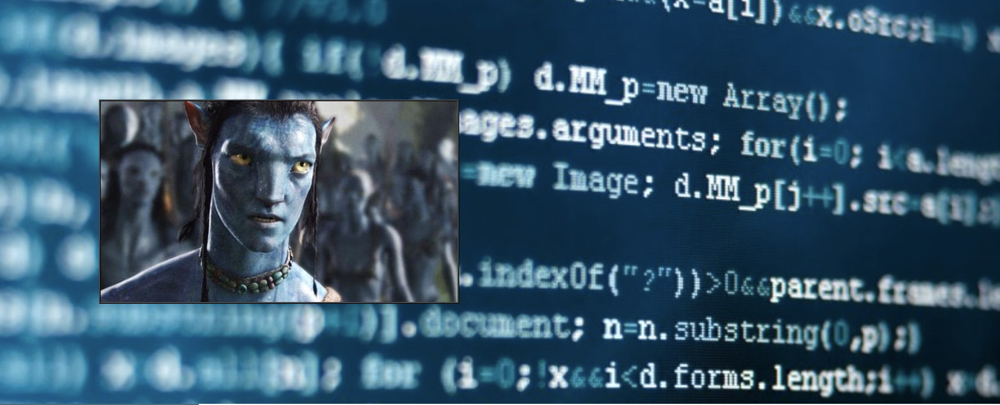
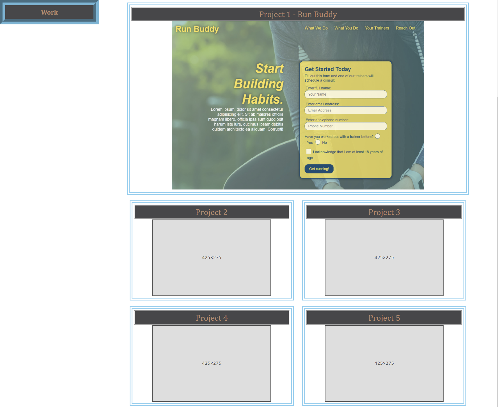
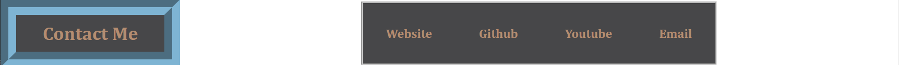

# Hamzah Ullah Portfolio

## **The Landing Page for the Portfolio Hamzah Ullah**
The portfolio page is an important and effective way for sharing past projects to future employers. Here we have met all the requirements for submission as well as a conduit for presenting out future work to potenton employers.

- HTML properties of a navigation to easily traverse the page and access our resume for download. 

- A eye-catching hero section to grasp the viewers attention as well as an extremely handsome avatar!

- An about me section that is for the moment, filled will the classic 'lorem' section. Currently under development to be completed for future employment opportunities!

- A list of past projects with the latest one being Run Buddy, at the very top indicating my first project! More works are later to be populated, currently populated with SVG placeholders.

- A contact me section my Website, Youtube, Github and a mail to section to give employers a chance reach out to me!

# Why it Matters?
Having a portfolio made early in your programming career makes it simple to archive all future code for employers to review. As a web developer, its important to continually improve and refer back to past codes and projects to learn from your mistakes, and improve all your projects along the way. 

Visit my portfolio for yourself [by clicking here](https://brobro10000.github.io) or follow the direct link at [https://brobro10000.github.io/](https://brobro10000.github.io/). 

## 
We Hope to see you there!
 ##